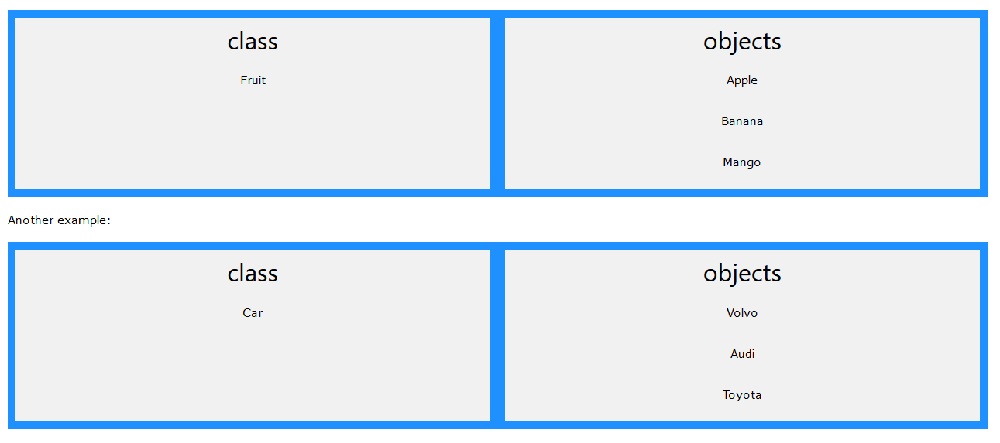

# Theoretical Java Programming Understanding

Object Oriented Language

Everything is focused around objects

Java needs a programmer to fully understand a problem to extract a theoretical model to be transferred into a class model.

The more accurate this is done, the less code has to be written, the easier it can be to maintain and the less error you will come across.

```
class Car(age, maxSpeed)

objects

myOldCar (10 years old, max speed 120)
myPorche (5 years old, max speed 150)
myFerrari (2 years old, max speed 200)

```

Objects will be created from the classes, these are created using a method called **constructor** and will create an object when called upon.
However, will not create an object is the object already exists.

to create a new object within a class you would do the following:

```
public void class Car(age, maxSpeed) {
    new Car(10,120);
}
```

Two numbers are given, one for the "age" and another for the "maxSpeed".
To store the object created into a variable we need to allocated it. This can be done like so:

```
public void class Car(age, maxSpeed) {
    Car myPorche = new Car(10,120);
}
```
# OBJECT ORIENTED PROGRAMMING (OOP)

Object-oriented programming is based on two main concepts; **OBJECTS** and **CLASSES**

Objects are considered structures that hold data and procedures for operating on that data.

Classes are considered "Blueprints" for those objects that define the data formats and procedures.

## Advantages of OOP

- Faster and easier to execute
- Provides a much clearer structure for debugging
- Improves Java code from becoming "DRY" (Don't Repeat Yourself) making code easier to maintain
- Makes it easier to create functional reusable applications in a shorter time period



The example above gives us a clear explanation to how classes can be considered as containers for objects
within its class (fruit: apples, bananas, mango etc.)

### - Classes are "TEMPLATES" for objects.
### - Objects are "INSTANCES" of classes.

---

EVERYTHING in Java is associated with **OBJECTS** and **CLASSES**

### Example

"in real life, a car is an **OBJECT**. The car has **ATTRIBUTES**, such as weight and color, and **METHODS**, such as drive and brake."